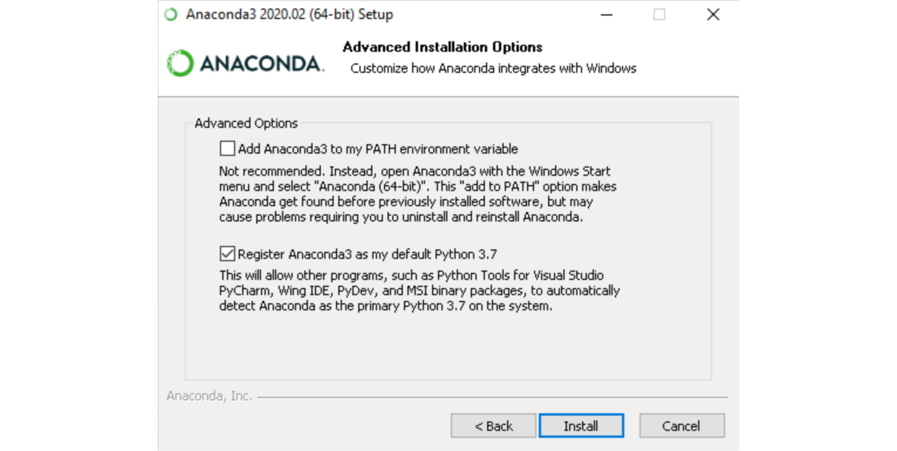
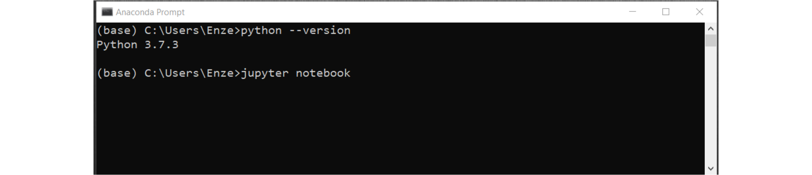

# Installing Python

This is a set of instructions to help guide you as you install Python and associated files on your computer. 
For this process, I typically like to accompany my mentee as they go through it, just to make sure that everything installs correctly without a hitch.
I know what it's like to be excited to start a software project, only to be blocked by troubleshooting the installation, so I don't want this misfortune to befall anyone.

## The Anaconda distribution

The native [Python language](https://www.python.org/) is already quite powerful, but there are several bells and whistles that have been developed by the community to make it even more powerful and user-friendly.
At some point, people realized that it made sense to bundle these along with the default Python code, and arguably the most popular **distribution** of Python is [Anaconda](https://www.anaconda.com/products/individual), or "conda" for short.
By installing Anaconda, we not only get Python, but also an entire suite of the most popular packages along with robust virtual environments.

1. To install Anaconda for yourself, download [the Individual Edition](https://www.anaconda.com/products/individual) with the most recent version of **Python 3**.
1. Open the installer and follow the instructions. Check the box that lets Anaconda be your default Python version, and **only if** you don't have other Python versions installed on your computer, you can also check the box that adds it to PATH.

1. Now to run Python:
    1. On Windows, you can use Anaconda Prompt; or if you added Anaconda to PATH, you can also use the Command Prompt.
    1. On Mac/Linux, you can use Terminal.

1. The first thing you should notice is the `(base)` word on the very left, which indicates the default virtual environment that is loaded. Seeing this is a good sign.
1. Type `python --version` to see which version of Python you have installed. If something reasonable shows up, then it's a good sign.
1. Type `jupyter notebook` to see if you can load the [Jupyter notebook](https://jupyter.org/) environment. You will need to do this to run the notebooks in this repo.

If you're able to do all of the above steps, then you should have everything you need to get started!

### Installing more packages

Sometimes, a package that we need (particularly if it's for a specific materials science application) does not come installed by default with Anaconda.
To see which packages are currently installed, you can use the `conda list` command.
To install more packages, there are several options, which I list in order of preference:

1. Use `conda install [package-name]`. This invokes Anaconda's built-in package manager to make sure there are no conflicts with existing packages and is generally the safest option (it's one of the main reasons people use Anaconda!).
1. Use a different channel to see if you can find the package, e.g. `conda install -c conda-forge [package-name]`.
1. Use `pip`, the default package manager in Python, e.g. `pip install [package-name]`.

### Troubleshooting

Python (and certain packages) can be very tricky to install, so if you run into issues, consult the Anaconda documentation, Google, or YouTube.

## Text editor / Integrated development environment (IDE)

While this repo primarily contains Jupyter notebooks for teaching purposes, it's often much easier to work on large programming projects (large files, many files, etc.) inside a text editor or IDE. 
Anaconda actually comes with a decent IDE, [Spyder](https://www.spyder-ide.org/), though some people prefer [PyCharm](https://www.jetbrains.com/pycharm/).
I actually prefer the look and feel of a simple text editor and encourage my mentees to install something like [Atom](https://atom.io/) or [Sublime Text](https://www.sublimetext.com/).